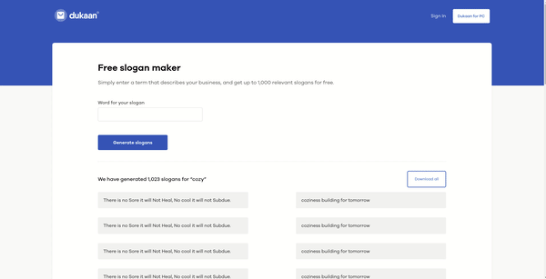

# Dukaan FrontEnd Assignment

Front end assignment for Dukkan 

Hosted on netlify : https://dukaan-frontend-assignment.netlify.app/


### Gif


**There are two methods for getting started with this repo.**


#### Familiar with Git ?

```
> git clone https://github.com/bhagat-hrishi/Dukaan-FrontEnd-Assignment.git 

> npm install
> npm start
> visit http://localhost:3000/ 
```

#### Not Familiar with Git ?
download the .zip file.  Extract the contents of the zip file, then open your terminal, change to the project directory, and:

```

> npm install
> npm start
> visit http://localhost:3000/
```

